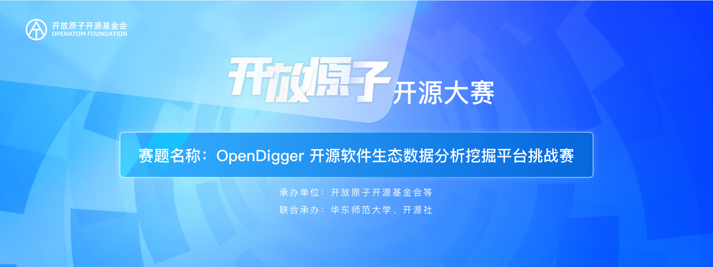
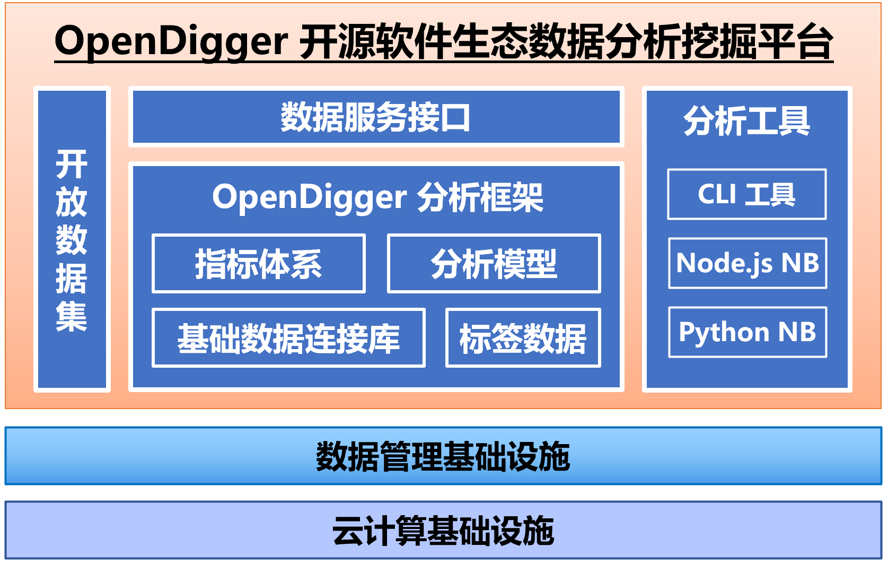
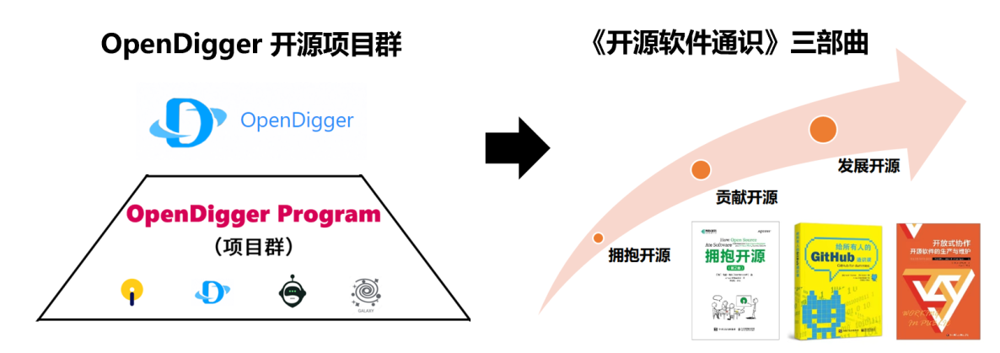

# OpenSODA | OpenDigger 开源软件生态数据分析挖掘平台挑战赛

#### 🔥🔥🔥News
- 8 月 29 日，[总投入超5000万元的开源大赛火热报名中](https://mp.weixin.qq.com/s/9WaLM8Ym6XL5jocd-V7ODA)
- 8 月 29 日，[2023开源和信息消费大赛新闻发布会在京召开](https://www.miit.gov.cn/xwdt/gxdt/sjdt/art/2023/art_d65d3e3e187d458bacd72b659ab9e3ff.html?share_token=eb12332d-f1e6-487d-9930-28d647eb2c89)
- 8 月 03 日，OpenSODA 挑战赛量化评分规则公布：[《📢OpenSODA 挑战赛量化评分规则》](https://xlab2017.yuque.com/staff-kbz9wp/olpzth/wltv2k6y4k5pohpg?singleDoc)
- 8 月 02 日，OpenSODA 挑战赛第一批决赛入围名单公布：[《📢OpenSODA 挑战赛第一批决赛入围名单发布！》](https://xlab2017.yuque.com/staff-kbz9wp/olpzth/gnsyvdce5wg1x4bg?singleDoc)
- 5 月 21 日，OpenSODA 挑战赛整体时间调整通知：[《📢关于 OpenSODA 挑战赛整体时间调整通知》](https://xlab2017.yuque.com/staff-kbz9wp/olpzth/tyyu5od84vxsi69l)
- 5 月 03 日，OpenSODA 挑战赛进入复赛名单发布暨作品提交时间延长通知：[《📢OpenSODA 挑战赛进入复赛名单发布暨作品提交时间延长通知》](https://xlab2017.yuque.com/staff-kbz9wp/olpzth/yfx21sg8qh98y5ek?singleDoc#)
- 4 月 20 日，OpenSODA 开放数据集正式发布：[《🎨OpenSODA 挑战赛开放数据集正式发布！》](https://xlab2017.yuque.com/staff-kbz9wp/olpzth/tq36xvyzg9b880hy?singleDoc#)
- 4 月 10 日，OpenSODA 挑战赛第二轮通知：[《🎊🎊OpenSODA | OpenDigger 开源软件生态数据分析挖掘平台挑战赛通知（第二轮）》](https://xlab2017.yuque.com/staff-kbz9wp/olpzth/khdrhgl063py1mqm?singleDoc# )
- 4 月 09 日，OpenSODA 赛题解读一览：[《「💁赛题解读」OpenSODA 赛题解读一览》](https://xlab2017.yuque.com/staff-kbz9wp/olpzth/hxlwkpfhyvf2p5xm?singleDoc# )
- 4 月 05 日，初赛知识问答正式发布：[《🏂OpenSODA 挑战赛初赛知识问答正式发布，欢迎来战！》](https://xlab2017.yuque.com/staff-kbz9wp/olpzth/gghgqg6z3tztgpau?singleDoc# )
- 4 月 03 日，《开源软件通识》第一部分完成上线：[《🎪 给所有 OpenSODA 参赛选手的通识课》](https://xlab2017.yuque.com/staff-kbz9wp/olpzth/umkehx7phbgg593s?singleDoc# )
- 3 月 20 日，报名通道正式打开：[《⛵OpenDigger 开源挑战赛报名流程正式发布》](https://xlab2017.yuque.com/staff-kbz9wp/olpzth/ma124i0lhi45h8xq?singleDoc#)
- 3 月 10 日，大赛正式启动，赛题发布：[《🎊OpenSODA | OpenDigger 开源软件生态数据分析挖掘平台挑战赛即将启动》](https://xlab2017.yuque.com/staff-kbz9wp/olpzth/vgzgtua6h3n0n7et?singleDoc#)

#### 1、赛事背景

随着开源技术体系逐渐成为全球数字化转型的核心驱动力，开源软件已经成为各类信息系统构建的公共基础件，关系着国家数字经济基础设施的未来。开源软件/组件与开源开放信息系统在各行业的持续发展，离不开开源知识体系的构建与开源人才的培养，加速培育中国主导的开源生态也已成为包括国家十四五规划在内的共识。

开放原子开源基金会于 2023 年发起首届“**开放原子开源大赛**”，旨在联合开源组织、企事业单位、高等院校、科研院所、行业组织、投融资机构等多方资源，搭建面向全球开源领域的前沿技术竞技、优秀人才选拔、创新成果展示、商业转化引导和对接交流合作平台，广泛传播开源文化、普及开源知识、推广开源项目、提升开源技能，为推进开源生态繁荣和可持续发展提供动力和支撑。

大赛期望达到以赛促用、以赛促教、以赛促学、以赛促练、以赛促创的效果，以开源的方式广泛征集赛题赛道，以开放协作的方式参与比赛，以分布式同行评审方式进行评比，通过大赛培养选拨一批顶尖人才，攻克重点技术难题，打造产业应用生态，厚植开源创新土壤，弘扬开放共享、奉献协作精神，为开源事业发展蓄势储能。

“**OpenDigger 开源软件生态数据分析挖掘平台挑战赛**”即是在这样一个背景下，通过申请、评审、通过的方式，成为本次大赛的数据基础设施赛道下的重要赛事，由**开放原子开源基金会**承办，由**华东师范大学**、**开源社**联合承办，由**木兰开源社区**、**CCF 信息系统专委会**、**CCF 开源发展委员会**作为顾问机构，**X-lab 开放实验室**作为技术支持。

#### 2、赛事简介

**OpenDigger** 是一个面向开源软件生态数据的一站式分析挖掘平台，目标是构建开源领域的数据生态，成为促进开源生态持续发展的数据基础设施开源项目，包括软件开发活动数据、软件生态对象关系数据、标签数据、度量指标、度量模型、实现算法、分析工具、以及大量社区分析案例集等，目前正在木兰开源社区孵化。**OpenDigger 开源软件生态数据分析挖掘平台挑战赛**（**Open**Source **So**ftware Ecosystem **Da**ta Analysis and Mining Platform Competition，**OpenSODA**）采取“2 + 1”的模式，**两个主题赛**和**一个贡献度排名赛**。

两个主题赛包括：**任务类（T）** 聚焦代码与算法的实现，OpenDigger 提供作品所需要的相关数据与基础设施，选手代码贡献提交到指定代码仓库中；**作品类（W）** 聚焦在可视化作品设计与实现上，OpenDigger 提供作品所需要的相关数据，选手选取某个可视化工具进行作品设计，并在指定的代码仓库中进行提交；一个**贡献度排名赛（R）** 为鼓励参赛选手尽可能通过协作的方式对 OpenDigger 项目进行贡献，组委会通过技术手段，记录并核算参赛选手在整个比赛期间的贡献，并根据贡献度排名进行奖励。参赛选手可以选择上述赛事类别中的一个或多个进行参加，不做任何限制。

OpenDigger 项目的官方网站为：[http://www.x-lab.info/open-digger/](http://www.x-lab.info/open-digger/)

#### 3、赛题设计

2023 年春季赛季（3 月 10 日起至 ~~6 月 30 日~~ 8 月 12 日 截至，总共 ~~四~~ 五个月的时间），包括三类赛题（“2 + 1”模式）。

**（1）任务类（T）**

本类型赛题聚焦 OpenDigger 项目本身的功能与算法实现，选手选择下列题目中的一个，进行方案设计并最终实现，最后提交到指定的代码仓库中，获得评审专家认可的作品将最终合并到 OpenDigger 的代码仓库中。

**T1：OpenDigger 指标的实现与优化**（开发类任务，预估难度：★）

**T2：命令行交互的指标结果查询子模块**（开发类任务，预估难度：★★）

**T3：基于机器学习的 OpenRank 指标拟合与优化**（数据科学类任务，预估难度：★★★）

**（2）作品类（W）**

数据可视化作品是对美学、内涵、共情的追求。本类型赛题将利用 OpenDigger 提供的各类开放数据、指标、模型、算法等，让参赛选手自由的发挥想象空间，将开源领域的数据洞察通过数据作品的形式进行呈现。

**W1：可视化艺术作品或数据洞察报告**（数据创意类作品，预估难度：★）

**W2：开源领域的可视化大屏**（Dashboard 类作品，预估难度：★★）

**W3：开源协作网络可视化**（网络可视化类作品，预估难度：★★★）

**（3）贡献度排名赛（R）**

开源的一大特点就是鼓励公开参与和开放协作，也是开源成功的要素之一。我们一致认为，一个开源社区中的所有贡献都是值得被铭记与赞扬的；我们相信，在开源的世界里，每一份贡献都值得回报。因此，除了任务类和作品类，“贡献度排名赛”将通过技术手段，记录参赛选手在比赛期间对 OpenDigger 项目的所有贡献，并根据贡献度排名进行奖励。（预估难度：★）

后续我们会安排对每个赛题的详细解读，欢迎大家持续关注！

#### 4、奖项设置与评审规则

2023 年春季赛季总奖金池为**50 万元**，奖项分配具体如下：

| **奖项**         | **数量** | **总奖金额** | **说明**                   |
| ---------------- | -------- | ------------ | -------------------------- |
| **一等奖**       | 1        | 10 万        | 评审专家委员会评议确定     |
| **二等奖**       | 5        | 15 万        | 评审专家委员会评议确定     |
| **三等奖**       | 10       | 10 万        | 评审专家委员会评议确定     |
| **创新贡献奖** | 50     | 15 万        | 评审专家委员会评议确定 |

一等奖、二等奖和三等奖的获奖作品由 OpenSODA 挑战赛的**评审专家委员会**来共同确定。**初赛**部分为知识问答，完成挑战赛对应的培训课程后，通过答题的方式进行（**80 分**及以上即为通过，并进入复赛，详细参见[这里](https://xlab2017.yuque.com/staff-kbz9wp/olpzth/gghgqg6z3tztgpau?singleDoc#)）；**复赛**为设计方案提交（组委会将同时给进入复赛的队伍提供开放样例数据集），专家评审委员会根据设计方案的内容进行打分，排序后根据分数高低确定进入决赛的队伍，总共不超过 **80 支队伍**进入决赛；**决赛**为代码实现作品的提交（组委会将同时给进入决赛的队伍提供更加系统全面的数据支持），由专家评审委员会对最终作品的提交内容进行打分，由高到低确定最终获奖名单。

**备注：**“创新贡献奖”根据参赛团队在比赛过程中的创新贡献来进行评定，例如参与度与贡献度，通过 OpenRank 算法进行评价。OpenRank 排名算法是 OpenDigger 项目中的核心算法，是参考中国电子技术标准化研究院开源治理标准制定完成，并通过标准制定专家组的评定与审核，目前已在工业界与学术界中被持续采用。

#### 5、挑战赛流程

挑战赛共分为三个阶段，初赛、复赛与决赛，具体时间线如下（暂定）：

| **时间**          | **大赛培训课程**   | **挑战赛端**     |
| ----------------- | ------------------ | ---------------- |
| ~~3.10 ~ 5.6 日~~ **3.10 ~ 6.30 日**| 第一阶段：拥抱开源 | **初赛**         |
| ~~4.4 ~ 5.8 日~~  **7.1 ~ 7.15 日**  | 第二阶段：贡献开源 | **复赛**         |
| ~~5.9 ~ 6.26 日~~ **7.16 ~ 8.12 日** | 第三阶段：发展开源 | **决赛**         |
| ~~7 月初~~        **8 月中下旬**        | -                  | **宣布获奖名单** |

OpenSODA 在开放原子开源大赛中的官方平台为：[https://competition.atomgit.com/competitionInfo?id=bc6603e0b8bf11ed804e6b78b4426d45](https://competition.atomgit.com/competitionInfo?id=bc6603e0b8bf11ed804e6b78b4426d45)

具体流程与相关信息将会持续更新，欢迎大家关注。同时，也会在 OpenSODA 挑战赛官方仓库同步：[https://atomgit.com/x-lab/OpenSODA](https://atomgit.com/x-lab/OpenSODA)

#### 6、挑战赛培训

为了更好的给参赛选手提供挑战赛指导，宣传开源技术与开源文化，本大赛还配套了一门《**开源软件通识**》的课程，在挑战赛期间分阶段提供给大家，助力大家更好的完成比赛。《**开源软件通识**》系列课程共有三个模块，分别是：

- **拥抱开源**：对应初赛阶段，带领新手漫游开源世界；
- **贡献开源**：鼓励大家参与开源贡献，带领大家如何开源协作；
- **发展开源**：深入了解开源生态发展，参与开源生态的共建。

培训课程的详细情况请见[《开源软件通识》](https://github.com/X-lab2017/oss101)

**7、评审专家委员会**

为了保证本次挑战赛的公开、公平、公正，特广泛邀请了工业界、学术界、开源社区等不同背景的专家共同参与本次挑战赛规则的制定，以及评审全过程。部分专家也会通过挑战赛社区，积极参与和大家进行互动、答疑与指导。以下排名不分先后：

- **陈阳**，开源社、微软
- **江波**，开源社、思否
- **庄表伟**，开源社
- **杨丽蕴**，木兰开源社区、中国电子技术标准化研究院
- **陈绪**，木兰开源社区、阿里云
- **王庆**，木兰开源社区、英特尔
- **周明辉**，木兰开源社区、CCF 开源发展委员会、北京大学
- **单致豪**，木兰开源社区、腾讯开源联盟
- **金耀辉**，木兰开源社区、上海交通大学
- **王涛**，木兰开源社区、开放原子、国防科大
- **王旭**，木兰开源社区、蚂蚁
- **李永乐**，木兰开源社区、华为
- **堵俊平**，开源雨林、华为
- **于戈**，CCF 信息系统专委、东北大学
- **周傲英**，CCF 信息系统专委、华东师范大学
- **王鑫**，CCF 信息系统专委、天津大学
- **王昊奋**，CCF 信息系统专委、同济大学
- **李晖**，CCF 信息系统专委、贵州大学
- **游兰**，CCF 信息系统专委、湖北大学
- **武延军**，CCF 开源发展委员会、中国科学院软件研究所
- **边思康**，CCF 开源发展委员会、蚂蚁
- **张宇霞**，CCF 开源发展委员会、北京理工大学
- **郭雪**，CCF 开源发展委员会、中国信息通信研究院
- **彭鑫**， CCF 开源发展委员会、软件工程专委、复旦大学
- **郭健美**，CCF 软件工程专委、华东师范大学教授
- **李兵**，CCF 软件工程专委、服务计算专委、武汉大学教授
- **张军**，开放原子基金会 TOC 成员、百度
- **姜宁**，Apache 基金会、华为
- **黄向东**，中国通信学会开源技术专委会、清华大学

报名系统已开放（截至时间 ~~5 月 6 日~~ 6 月 30 日 ），欢迎大家积极报名，也预祝大家取得好的成绩！
